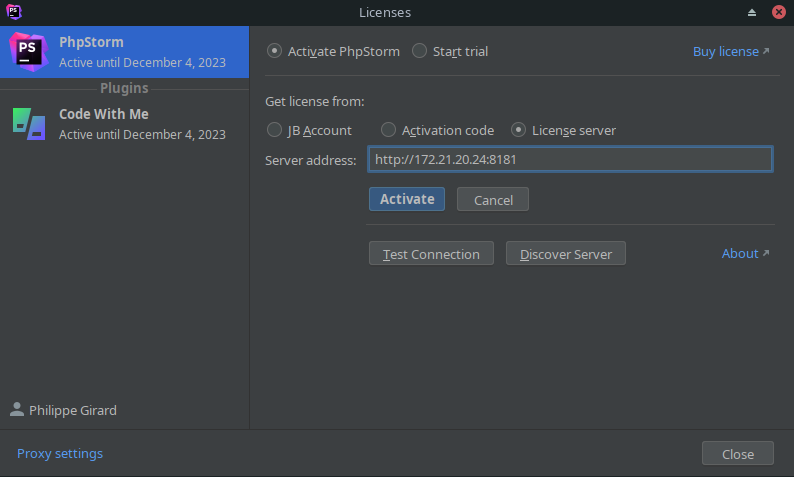

# Jetbrains

Pour tous les logiciels: IntelliJ, CLion, WebStorm, PhpStorm, GoLand.

Bien que c'est possible d'utiliser un seul IDE pour tous les langages, chaque IDE Jetbrains a été conçu pour un langage spécifique.

## Installation

Jetbrains offre 2 solutions:

 1. Utiliser le [Toolbox](https://www.jetbrains.com/toolbox-app/) qui permet d'installer chaque IDE facilement
 2. Installation individuellement chaque IDE, par exemple [PhpStorm](https://www.jetbrains.com/phpstorm/download/)

L'installation est simple pour tous les IDE.

## Licence

Au cégep, vous pouvez utiliser le serveur de licence avec l'adresse http://172.21.20.24:8181:

Pour l'utiliser de la maison (à moins de tenir le VPN toujours ouvert), vous devez demander une licence à l'adresse: https://www.jetbrains.com/shop/eform/students. Vous devez utiliser votre adresse courriel du cégep (votreda@etu.cegep-lanaudiere.qc.ca).

## Configuration

À venir