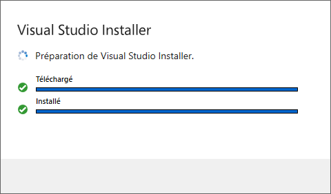
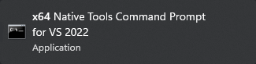

# Outils de développement C/C++

Compilateur, lieur, débogueur, et bibliothèques systèmes des langages C et C++.

## Téléchargement

[Télécharger](https://aka.ms/vs/17/release/vs_BuildTools.exe) le programme d'installation des outils de développement C/C++.

## Installation

Exécuter le programme d'installation et cliquer sur le bouton « Continuer » :

Patienter pendant la préparation des prérequis :

Cocher la case « Développement Desktop en C++ » et cliquer sur le bouton « Installer » :

Patienter pendant l'installation :

Les outils de développement C/C++ sont maintenant installés :

## Terminal

Créer un raccourci sur le bureau, ou dans la barre des tâche, de la console de développement:

