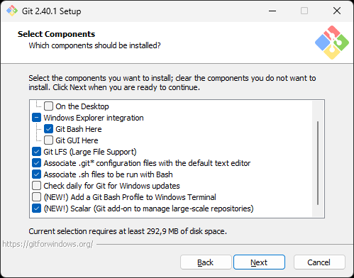
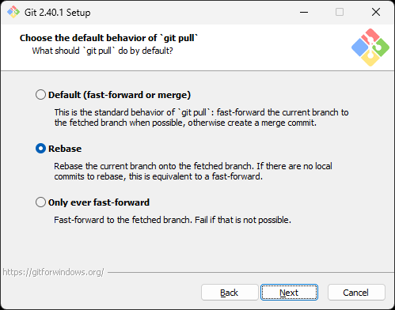

# Git

Système de gestion de versions.

## Téléchargement

Télécharger le programme d'installation de Git :

https://github.com/git-for-windows/git/releases/download/v2.40.1.windows.1/Git-2.40.1-64-bit.exe

## Installation

Exécuter le programme d'installation et cliquer sur le bouton « Next » :

Cliquer sur le bouton « Next » :

Cocher les options suivantes et cliquer sur le bouton « Next » :

Cliquer sur le bouton « Next » :

Sélectionner l'éditeur désiré et cliquer sur le bouton « Next » :

Sélectionner la deuxième option et cliquer sur le bouton « Next » :

...

...

...

...

...

...

...

...

...

...

...

