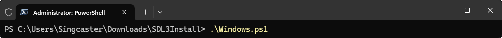

# Simple DirectMedia Layer 3

Bibliothèque de développement graphique.

## Téléchargement

[Télécharger](https://clogik.io/WINSDL3Install.zip) le script d'installation de la bibliothèque SDL3.

## Installation

Dans un terminal « PowerShell » en mode administrateur, exécuter le script d'installation de la bibliothèque SDL3 :

