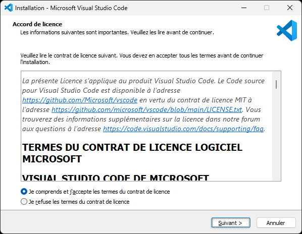
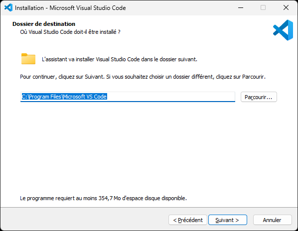
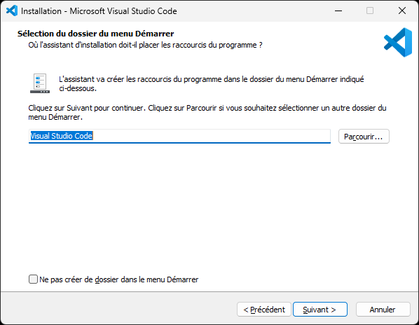
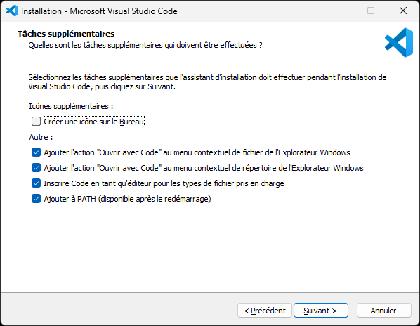
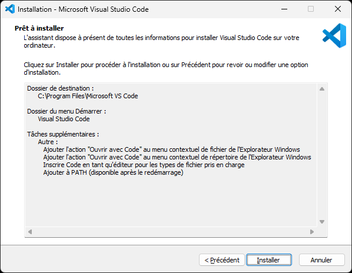
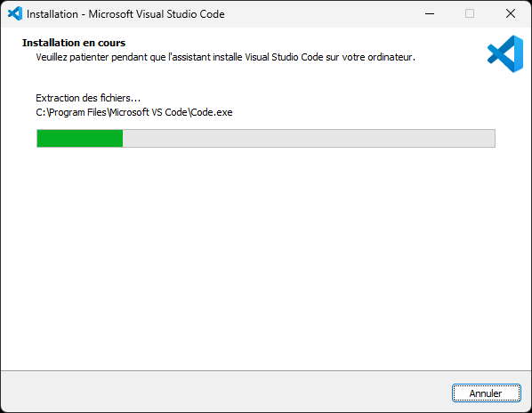
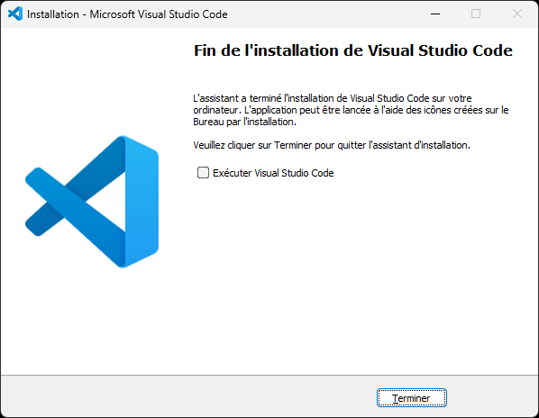

# Visual Studio Code

Éditeur de code générique.

## Téléchargement

Télécharger le programme d'installation de Visual Studio Code :

https://code.visualstudio.com/docs/?dv=win64

## Installation

Exécuter le programme d'installation, sélectionner « Je comprends ... », et cliquer sur le bouton « Suivant » :

Cliquer sur le bouton « Suivant » :

...

...

...

...

Visual Studio Code est maintenant installé, cliquer sur le bouton « Terminer » :

## Extensions

...

### C/C++

...

### Doxygen

...
