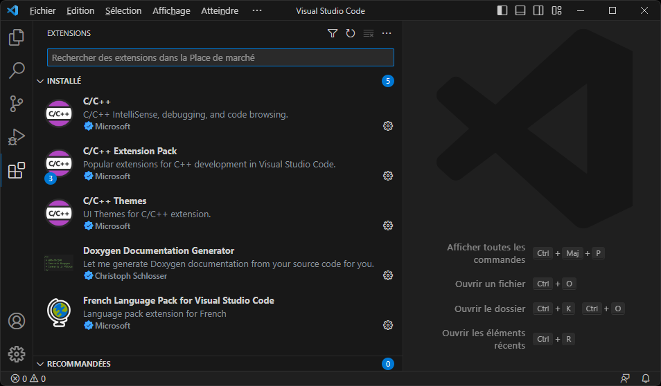

# Visual Studio Code

Éditeur de code générique.

## Téléchargement

[Télécharger](https://code.visualstudio.com/docs/?dv=win64user) le programme d'installation de Visual Studio Code.

## Installation

Exécuter le programme d'installation, sélectionner « Je comprends ... », et cliquer sur le bouton « Suivant » :

Cliquer sur le bouton « Suivant » :

Cliquer sur le bouton « Suivant » :

Cocher les options suivantes et cliquer sur le bouton « Suivant » :

Cliquer sur le bouton « Installer » :

Patienter :

Visual Studio Code est maintenant installé, cliquer sur le bouton « Terminer » :

## Extensions

Lors du premier démarrage, il est fort probable que Visual Studio Code demande d'installer le « Pack de langage » selon la langue de votre système d'exploitation.

Dans l'onglet « Extensions » de Visual Studio Code, rechercher et installer aussi l'extensions « C/C++ ».

