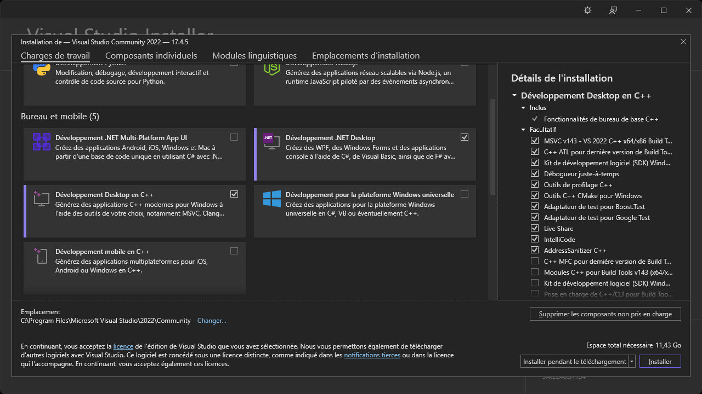
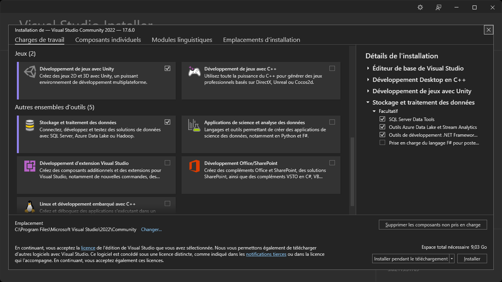

# Visual Studio Community 2022

Éditeur pour une multitude de langages et technologies Microsoft Windows.

## Téléchargement

Télécharger le programme d'installation de Visual Studio Community 2022 :

https://visualstudio.microsoft.com/thank-you-downloading-visual-studio/?sku=Community&channel=Release&version=VS2022&source=VSLandingPage&cid=2030&passive=false

## Installation

Exécuter le programme d'installation et cliquer sur le bouton « Continuer » :

Patienter pendant la préparation des prérequis :

Cocher les options suivantes de la section « Bureau et mobile » :

Cocher les options suivantes de la section « Autres ensembles d'outils » et cliquer sur le bouton « Installer » :

Patienter pendant l'installation :

Visual Studio Community 2022 est maintenant installé :

